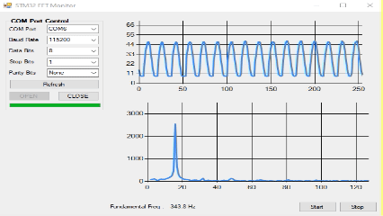

# FFT Monitor for STM32



> 상단: Raw ADC 파형 / 하단: FFT 스펙트럼 (Fundamental Freq 표시)


> 실시간 수신 동작 화면 (Raw / FFT 차트 동시 갱신)

STM32 보드에서 시리얼(UART/COM) 포트로 전송하는 **Raw ADC 데이터**와 **FFT 연산 결과**를 PC에서 실시간으로 수신하여 그래프로 표시하는 Windows 모니터링 도구입니다.

C# WinForms 기반이며, `System.Windows.Forms.DataVisualization` 차트를 사용해 두 개의 그래프(Raw / FFT)를 동시에 그립니다.

## 주요 기능

- COM 포트 자동 검색 및 통신 설정(Baud Rate, Data Bits, Stop Bits, Parity) 구성
- 시리얼 흐름 제어 신호(CTS / DSR / DTR / RTS / CD) 표시
- HEX(바이너리) 커스텀 프로토콜 수신·파싱 (Raw / FFT 패킷 구분)
- 전용 파서 스레드 + 상태머신 기반의 안정적인 수신 처리 (시간이 지나도 끊김 없음)
- Raw ADC 파형(Time Domain)과 FFT 스펙트럼(Freq Domain)을 별도 차트로 실시간 갱신
- 차트 축 고정 표시 · Y축 라벨 정수화 · 마우스 휠로 Y축 확대/축소
- FFT 피크 기반 Fundamental Frequency(기본 주파수) 표시

## 통신 프로토콜

STM32 펌웨어는 다음 포맷으로 패킷을 전송해야 합니다. (big-endian 길이 필드)

| 필드      | 크기(byte) | 값 / 설명                          |
|-----------|-----------|-----------------------------------|
| Sync      | 2         | `0x03`, `0x15`                    |
| ID        | 1         | `0x01` = Raw 데이터, `0x02` = FFT 데이터 |
| Length    | 2         | 페이로드 바이트 수 (`hi << 8 | lo`) |
| Payload   | Length    | 데이터 본문                        |

- **Raw 패킷(ID `0x01`)**: 1바이트 = 1샘플 (256개, 0~255). Time Domain 파형으로 표시합니다.
- **FFT 패킷(ID `0x02`)**: 4바이트 IEEE-754 `float` × N (1024바이트 = 256개). PC 측에서 `BitConverter.ToSingle`로 복원해 앞쪽 절반(`Samples / 2`)만 표시합니다. 페이로드 길이가 4의 배수가 아니면 손상 패킷으로 보고 버립니다.

> 기본 샘플 수는 `Samples = 256`으로 설정되어 있습니다 (`Form1.cs`).

## 요구 환경

- Windows
- .NET Framework 4.7.2
- Visual Studio 2017 이상 (WinForms 개발 워크로드)

## 빌드 및 실행

Visual Studio에서 `FFT_Monitor_STM32.sln`을 열고 빌드(F5)하거나, MSBuild를 사용합니다:

```sh
msbuild FFT_Monitor_STM32.sln /p:Configuration=Release
```

빌드 결과물은 `bin\Release\FFT_Monitor_STM32.exe` 에 생성됩니다.

## 사용법

1. STM32 보드를 PC에 연결합니다.
2. 프로그램을 실행하고 **Refresh**로 COM 포트를 검색합니다.
3. 포트 / Baud Rate 등 통신 파라미터를 설정한 뒤 **OPEN**을 클릭합니다.
4. **Start**를 눌러 Raw / FFT 차트 갱신을 시작하고, **Stop**으로 중지합니다.
5. 차트 위에 마우스를 올린 상태에서 휠을 돌리면 해당 그래프의 Y축이 확대/축소됩니다.

## 문제와 해결 (Issues & Fixes)

> ✅ **아래 스레드 안정성·파싱 문제들은 모두 해결되었습니다.**
>
> 초기 구현에서는 **시간이 지나면 수신이 멈추고 그래프 갱신이 끊기는** 현상이 있었습니다.
> 원인은 시리얼 수신 핸들러 내부의 블로킹 처리와, 수신 스레드·UI 타이머 간 비동기화 공유 배열 접근이었습니다.
> 각 문제의 원인 코드와 **실제 적용한 해결 코드**를 함께 기록합니다.

### 문제 1. `ReadByte()` — 수신 콜백 스레드를 블로킹하고 모달 팝업까지 띄움 (`Form1.cs`)

```csharp
private int ReadByte()
{
    int trial = 50;
    while (trial > 0)                          // ← 최대 50번 반복
    {
        if (serialPort1.BytesToRead > 0)
        {
            return serialPort1.ReadByte();
        }
        Thread.Sleep(1);                       // ← 수신 콜백 스레드를 잠재움
        trial--;
    }
    if (trial == 0)
    {
        MessageBox.Show("데이터가 없습니다.");   // ← 수신 스레드에서 모달 창!
    }
    return 0;
}
```

**✅ 해결** — 수신 핸들러에서 `Thread.Sleep`·`MessageBox`·바이트 단위 블로킹을 모두 제거하고, 버퍼를 통째로 읽어 큐에 넣고 즉시 반환합니다.

```csharp
private void serialPort1_DataReceived(object sender, SerialDataReceivedEventArgs e)
{
    try
    {
        int n = serialPort1.BytesToRead;
        if (n <= 0) return;
        var buf = new byte[n];
        int read = serialPort1.Read(buf, 0, n);
        if (read < n) Array.Resize(ref buf, read);
        if (read > 0) _rx.Add(buf);   // 큐에 넘기고 즉시 반환 (Sleep/MessageBox 제거)
    }
    catch { }
}
```

### 문제 2. `serialPort1_DataReceived` — 위 `ReadByte()`를 바이트마다 반복 호출 + 비동기화 공유 배열 교체 (`Form1.cs`)

```csharp
private void serialPort1_DataReceived(object sender, SerialDataReceivedEventArgs e)
{
    ...
    sync[0] = this.ReadByte();     // 한 바이트마다 최대 50ms 블로킹 가능
    sync[1] = this.ReadByte();
    id[0]   = this.ReadByte();
    ...
    while (tot_size > 0)
    {
        DataBuffer_Raw.Add(this.ReadByte());    // 수백 바이트 × 블로킹 루프
        tot_size--;
    }
    RawIntDataArray = DataBuffer_Raw.ToArray();  // ← 동기화 없이 공유 배열 교체
}
```

**✅ 해결** — 파싱을 전용 파서 스레드로 분리(Producer-Consumer)하고 상태머신으로 패킷을 조립하며, 완성된 배열을 `lock`으로 보호해 교체합니다.

```csharp
// 전용 파서 스레드: 상태머신으로 분할 수신/재동기화 처리
private void ParserLoop()
{
    var st = St.Sync0;
    foreach (var chunk in _rx.GetConsumingEnumerable())
        foreach (byte b in chunk)
            // Sync0 → Sync1 → Id → LenHi → LenLo → Payload, 완성 시 Dispatch(id, pl)
            ;
}

private void Dispatch(byte id, byte[] pl)
{
    if (id == ID_RAW)      { /* 1바이트=1샘플 디코딩 */ lock (_lock) _rawSnap = r; }
    else if (id == ID_FFT) { /* float32 디코딩 */       lock (_lock) _fftSnap = f; }
}
```

### 문제 3. `timer1_Tick` / `timer2_Tick` — UI 스레드가 같은 공유 배열을 lock 없이 읽음 (`Form1.cs`)

```csharp
private void timer1_Tick(object sender, EventArgs e)
{
    chart1.Series["Series1"].Points.Clear();

    for (int i = 0; i < Samples; i++)
    {
        RawIntArray[i] = RawIntDataArray[i];   // ← 수신 스레드가 교체 중인 배열을 동시 읽기
    }
    for (int i = 0; i < Samples; i++)
    {
        chart1.Series["Series1"].Points.AddXY(i, RawIntArray[i]);
    }
}

private void timer2_Tick(object sender, EventArgs e)
{
    chart2.Series["Series1"].Points.Clear();

    for (int i = 0; i < Samples * 4; i++)
    {
        FFTByteArray[i] = (byte)FFTIntDataArray[i];   // ← 패킷 크기가 다르면 IndexOutOfRange
    }
    for (int i = 0; i < Samples; i++)
    {
        FFTFloatArray[i] = BitConverter.ToSingle(FFTByteArray, i * 4);
    }
    for (int i = 2; i < Samples / 2; i++)
    {
        chart2.Series["Series1"].Points.AddXY(i, FFTFloatArray[i]);
    }
}
```

`Samples(256)` 크기를 고정 가정하므로, 수신 패킷 크기가 다르거나 교체 도중 읽으면 예외가 발생하고, 한 번 예외가 나면 해당 타이머 틱이 죽어 그래프 갱신이 멈춥니다.

**✅ 해결** — 타이머는 `lock`으로 스냅샷 참조만 받아 그리고, `Math.Min`으로 크기를 안전하게 제한합니다. (차트 Y축 고정 + 값 가드로 OverflowException도 방지)

```csharp
private void timer1_Tick(object sender, EventArgs e)
{
    int[] r; lock (_lock) r = _rawSnap;          // 참조만 잠깐 잠금
    var s = chart1.Series["Series1"]; s.Points.Clear();
    int n = Math.Min(Samples, r.Length);         // 크기 안전 처리
    for (int i = 0; i < n; i++) s.Points.AddXY(i, r[i]);
}
```

### 적용 결과 (요약)

- **Producer-Consumer 구조**: `BlockingCollection<byte[]>` 큐 + 전용 파서 스레드(`IsBackground`)
- **상태머신 파서**: `Sync0 → Sync1 → Id → LenHi → LenLo → Payload`, 분할 수신/재동기화, 길이 검증
- **공유 데이터 보호**: `lock` + 스냅샷 참조 교체로 경쟁 조건 제거
- **차트 안정화**: Y축 고정 · 정수 라벨 · NaN/Infinity/초대형 값 가드로 OverflowException 방지
- **UI 개선**: ASCII 제거(HEX 전용), 마우스 휠 Y축 확대/축소, Fundamental Frequency 표시
- **안전 종료**: `volatile` 플래그 + `CompleteAdding()` + `Join()`

## 프로젝트 구조

```
FFT_Monitor_STM32/
├── Form1.cs              # 메인 로직 (시리얼 통신, 프로토콜 파싱, 차트 갱신)
├── Form1.Designer.cs     # UI 레이아웃
├── Program.cs            # 진입점
├── Properties/           # 어셈블리 정보, 리소스, 설정
└── FFT_Monitor_STM32.sln # 솔루션 파일
```

## 참고 자료 (References)

FFT를 펌웨어로 구현하기에 앞서, **Excel로 시간 영역 → 주파수 영역 변환 과정을 먼저 검증**하며 원리를 이해했습니다. 아래 자료를 참고했습니다.

- **[Frequency Domain Using Excel](docs/references/Excel_FFT_Instructions.pdf)** — Larry Klingenberg, San Francisco State University, School of Engineering (April 2005)
  - Excel의 *Analysis ToolPak → Fourier Analysis* 기능으로 샘플 데이터를 FFT 복소수로 변환하고, 크기 스펙트럼을 그리는 단계별 가이드
- **[FFT 예제 스프레드시트](docs/references/FFT_example.xlsx)** — Signal Generator로 주파수를 생성하고 이를 Oscilloscope에 연결하여 그 데이터를 엑셀로 추출해서 위의 가이드를 통해서 동일하게 작업을 진행했고, 이를 통해서 어떤 FFT를 구현하기 위해서 중요한 척도 및 파라미터가 무엇인지 공부할 수 있었음.
  - 컬럼 구성: `second`(시간) · `Volt`(샘플 데이터) · `FFT Freq` · `FFT complex` · `FFTmag`, 파라미터: `Data length(D)`, `sampling time(t)`, `sampling Freq(Fs)`