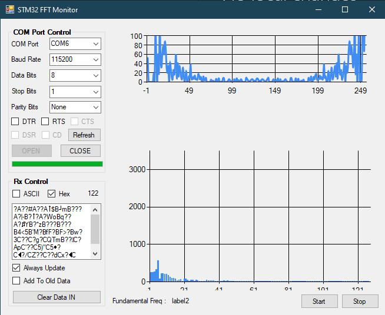

# FFT Monitor for STM32



> 상단: Raw ADC 파형 / 하단: FFT 스펙트럼 (Fundamental Freq 표시)

STM32 보드에서 시리얼(UART/COM) 포트로 전송하는 **Raw ADC 데이터**와 **FFT 연산 결과**를 PC에서 실시간으로 수신하여 그래프로 표시하는 Windows 모니터링 도구입니다.

C# WinForms 기반이며, `System.Windows.Forms.DataVisualization` 차트를 사용해 두 개의 그래프(Raw / FFT)를 동시에 그립니다.

## 주요 기능

- COM 포트 자동 검색 및 통신 설정(Baud Rate, Data Bits, Stop Bits, Parity) 구성
- 시리얼 흐름 제어 신호(CTS / DSR / DTR / RTS / CD) 표시
- ASCII / HEX 수신 모드 지원
- STM32 커스텀 프로토콜 파싱 (Raw / FFT 패킷 구분)
- Raw ADC 파형과 FFT 스펙트럼을 별도 차트로 실시간 갱신
- 수신 데이터 항상 갱신 / 누적 표시 모드 선택

## 통신 프로토콜

STM32 펌웨어는 다음 포맷으로 패킷을 전송해야 합니다. (big-endian 길이 필드)

| 필드      | 크기(byte) | 값 / 설명                          |
|-----------|-----------|-----------------------------------|
| Sync      | 2         | `0x03`, `0x15`                    |
| ID        | 1         | `0x01` = Raw 데이터, `0x02` = FFT 데이터 |
| Length    | 2         | 페이로드 바이트 수 (`hi << 8 | lo`) |
| Payload   | Length    | 데이터 본문                        |

- **Raw 패킷(ID `0x01`)**: ADC 샘플 값 (정수 배열, 256 샘플 기준)
- **FFT 패킷(ID `0x02`)**: 4바이트 IEEE-754 `float` 단위로 인코딩된 FFT 결과 (`Samples × 4` 바이트). PC 측에서 `BitConverter.ToSingle`로 복원해 앞쪽 절반(`Samples / 2`)만 표시합니다.

> 기본 샘플 수는 `Samples = 256`으로 설정되어 있습니다 (`Form1.cs`).

## 요구 환경

- Windows
- .NET Framework 4.7.2
- Visual Studio 2017 이상 (WinForms 개발 워크로드)

## 빌드 및 실행

Visual Studio에서 `FFT_Monitor_STM32.sln`을 열고 빌드(F5)하거나, MSBuild를 사용합니다:

```sh
msbuild FFT_Monitor_STM32.sln /p:Configuration=Release
```

빌드 결과물은 `bin\Release\FFT_Monitor_STM32.exe` 에 생성됩니다.

## 사용법

1. STM32 보드를 PC에 연결합니다.
2. 프로그램을 실행하고 **Refresh**로 COM 포트를 검색합니다.
3. 포트 / Baud Rate 등 통신 파라미터를 설정한 뒤 **OPEN**을 클릭합니다.
4. 수신 모드(ASCII / HEX)를 선택합니다. (프로토콜 파싱은 HEX 모드 기준)
5. **Start**를 눌러 Raw / FFT 차트 갱신을 시작하고, **Stop**으로 중지합니다.

## 알려진 문제 (Known Issues)

> ⚠️ **스레드 처리 안정성 문제 (가장 중요)**
>
> 현재 시리얼 수신(`DataReceived` 이벤트 스레드)과 차트 갱신(`timer1` / `timer2` UI 스레드)이
> 공유 배열(`RawIntDataArray`, `FFTIntDataArray` 등)에 **동기화 없이 동시에 접근**합니다.
> 이로 인해 **시간이 지나면 데이터 수신이 멈추거나, 그래프 갱신이 더 이상 반영되지 않는** 현상이 발생합니다.
>
> 수신 스레드와 UI 갱신 사이의 스레드 동기화 / 버퍼 관리 구조를 재설계할 필요가 있습니다.
> (예: lock 기반 보호, 더블 버퍼링, Producer-Consumer 큐 도입 등)

## 프로젝트 구조

```
FFT_Monitor_STM32/
├── Form1.cs              # 메인 로직 (시리얼 통신, 프로토콜 파싱, 차트 갱신)
├── Form1.Designer.cs     # UI 레이아웃
├── Program.cs            # 진입점
├── Properties/           # 어셈블리 정보, 리소스, 설정
└── FFT_Monitor_STM32.sln # 솔루션 파일
```
